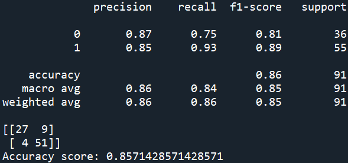
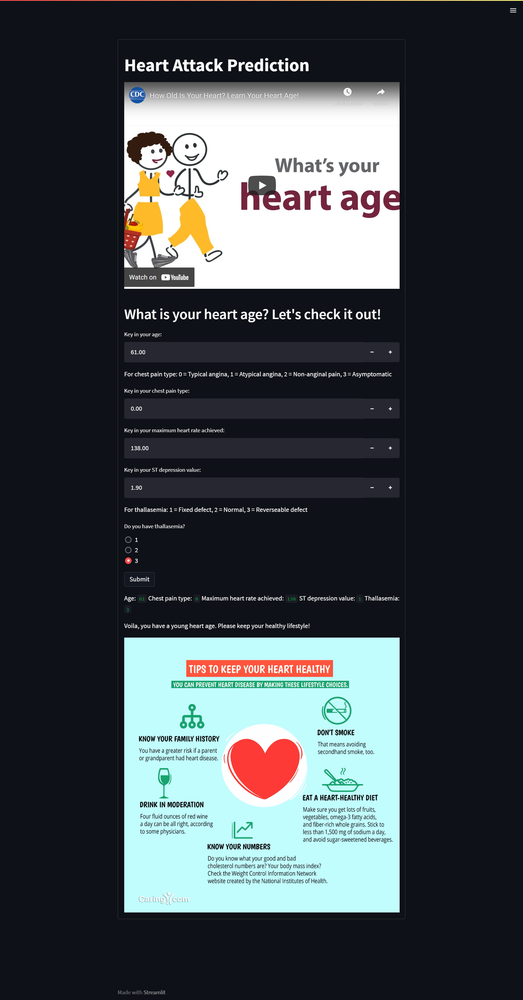
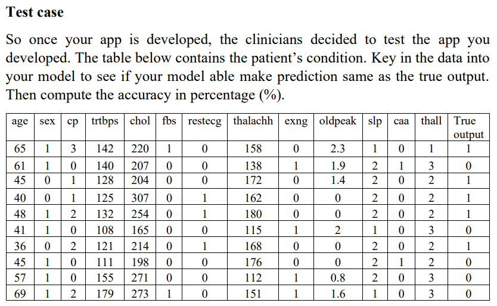

# Predictive Classification Model by Using Machine Learning Model Support Vector Classification (SVC) for Heart Attack Analysis.
 Using machine learning model to train over 300  Heart Attack Analysis and Prediction dataset to categorize either the person has a chance to get heart attack or not.

## Description
1. The project's objective is to predict the chance to get Cardiovascular Disease (CVD) based on several medical factors.
2. To get a heart disease, many medical factors need to be measured, which can be used to predict based on these factors
3. The dataset contains 5 continuous features, 8 categorical features, 1 categorical target and 1 duplicate data. There are also 2 Null values based on the dataset descriptions from the link in the credit section below.
4. The features selected from the dataset are only age, cp, thalachh, oldpeak and thall since they have the highest correlation to the target, which is output.
5. By using sklearn.pipeline method to compare between Min Max Scaler & Standard Scaler for scaling and Logistic Regression, Random Forest, Decision Tree, KNeigbors & SVC for classifier, the machine learning model used that give the highest accuracy is Support Vector Classification (SVC) and the scaler used is Standard Scaler.
6. Methods that can be used to improve the model such as increasing the amount of data to be train and reducing the outliers.

### Machine learning model link
[sklearn.svm.SVC](https://scikit-learn.org/stable/modules/generated/sklearn.svm.SVC.html)

## Results
Model score:

## Discussion
1. The best machine learning model achieved 85.7% accuracy during model testing. 
2. Recall and f1 score report 93% and 89% respectively. 
3. After the deployment of the Streamlit app, 10 new data inside the Assignment 1.pdf file were tested by key in the data needed, 8 over 10 data outputs were predicted correctly. The other two data that give the wrong outputs are the row of age 45 and age 69.

## Credits:
Shout out to Rashik Rahman from Kaggle for the Heart Attack Prediction Dataset. Check out the dataset by clicking the link below. :smile:
### Dataset link
[Heart Attack Analysis & Prediction Dataset](https://www.kaggle.com/datasets/rashikrahmanpritom/heart-attack-analysis-prediction-dataset)
